# Лабораторная работа №2
> **Выполнили:** Сигал Никита, Романова Алескандра

## Общая архитектура
Работа написана на **C++** с использованием **OpenMPI** в качестве реализации **MPI**.

Матрицы реализованы в виде класса `Matrix`, хранящим данные в виде одномерного массива `double`.

Были также созданы два пространства имен – `Global` и `MPI`. В пространстве имен `Global` определены используемые повсеместно данные – матрицы и потоки файлового ввода вывода.
В пространстве имен `MPI` определены переменные `processCount` и `processID` и несколько функций для удобства.

Программа получает на вход два параметра – имя файла ввода и название алгоритма, который нужно использовать.
Файл ввода хранит в себе размерности входных матриц и сами матрицы.

Доступные алгоритмы:
- `naive` – классический последовательный алгоритм перемножения матриц, как оператор класса `Matrix`
- `row`– разбиение по строкам
- `column` – разбиение по столбцам
- `block` – разбиение по блокам
- `cannon` – вычисление по **_алгоритму Кэннона_**

## Задание 1
### Реализация
Все алгоритмы первого задания реализуют задачу перемножения двух матриц произвольных размеров. Единственным ограничением является необходимость предоставлять число процессов, равное квадрату размера разбиения, для алгоритма разбиения по блокам.

Алгоритм разбиения по строкам распределяет строки матрицы A между процессами при помощи `MPI_Scatterv()` и матрицу B целиком через `MPI_Bcast()`.
Получившиеся промежуточные подматрицы С собираются обратно при помощи `MPI_Gatherv()`.

Алгоритм разбиения по столбцам частично переиспользует построчный алгоритм, транспонируя матрицу чтобы потом распространять столбцы как строки.
Каждый процесс здесь получает уже не целую матрицу B, а только строки соответствующие переданным столбцам также при помощи `MPI_Scatterv()`.
Матрица на каждом процессе создается уже полном размере, а итоговый результат суммируется через `MPI_Reduce()`.

Алгоритм разбиения по блокам сначала пересобирает свои данный в новый массив, где элементы матрицы упорядочены по порядку блоков, к которым они принадлежат.
Затем полученные переупорядоченные данный распределяются по процессам в маленькие подматрицы. Из матрицы B также распространяются только необходимые для вычислений строки.
Результирующая матрица аггрегируется через `MPI_Reduce()`.

### Графики
> В графиках указаны размеры N матриц `N * N`.
> Размеры были подобраны для дальнейшего использования при оценке алгоритма Кэннона
> 
> Файлы входных данных можно найти в папке `./inputs`
> 
> Табличные результаты измерений – в папке `./results`

#### Наивный алгоритм
Хоть графики для нас тут смысла особого и не несут, оставим их здесь, чтобы подчеркнуть важность повторных замеров –
для алгоритма, работающего на одном единственном процессе, мы каким-то образом смогли получить ускорение `1.7`.
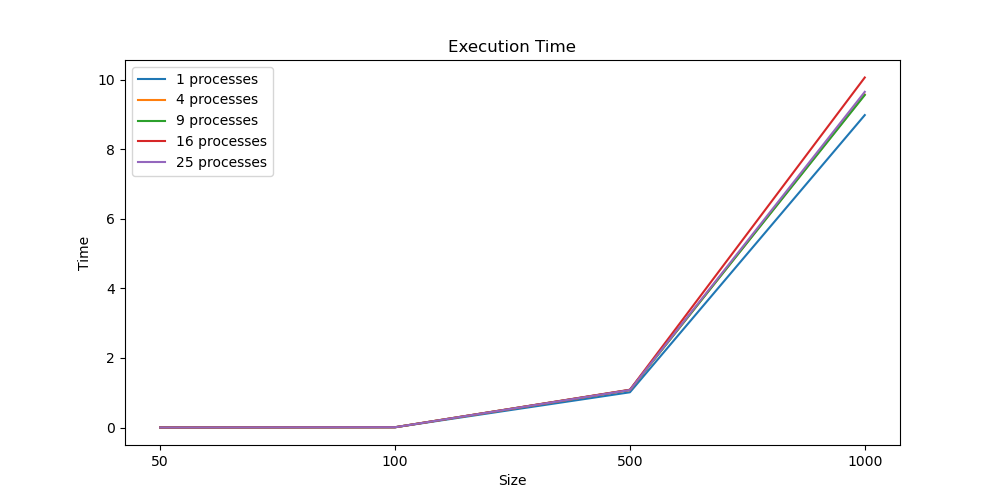
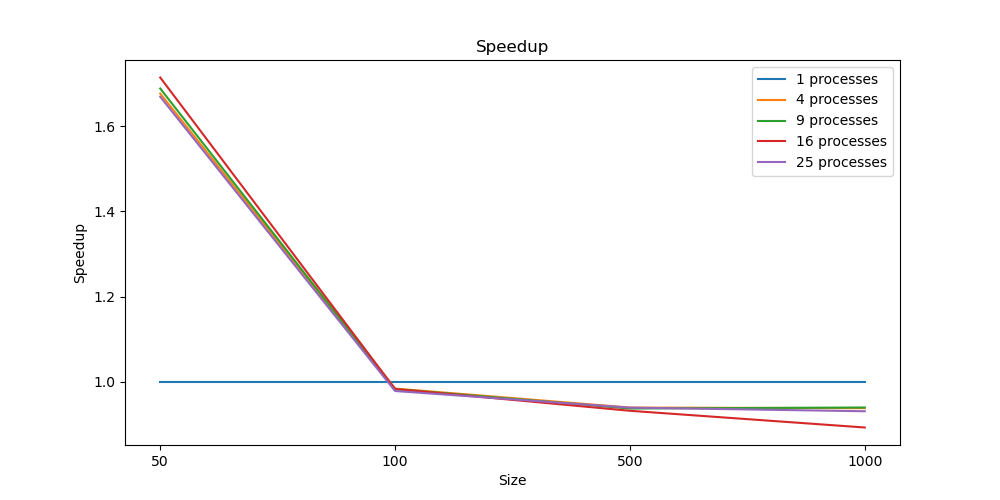
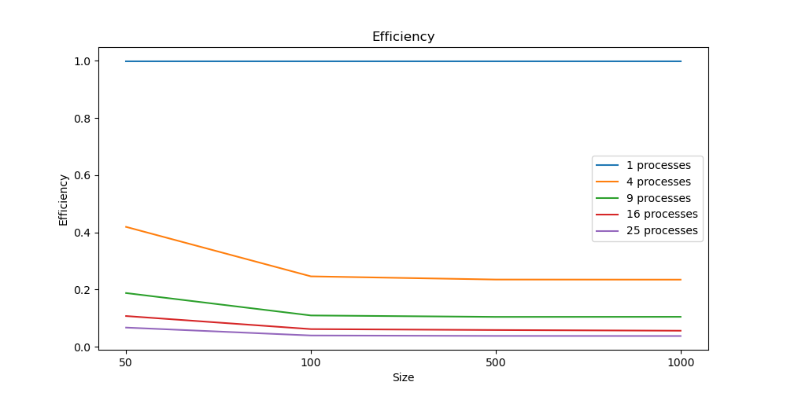

#### Разбиение по строкам
Наилучшее ускорение – около `4.5`, причем для 4 процессов достигается очень высокая эффективность.
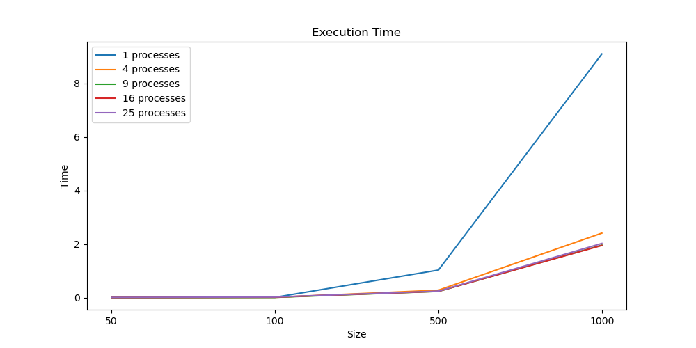
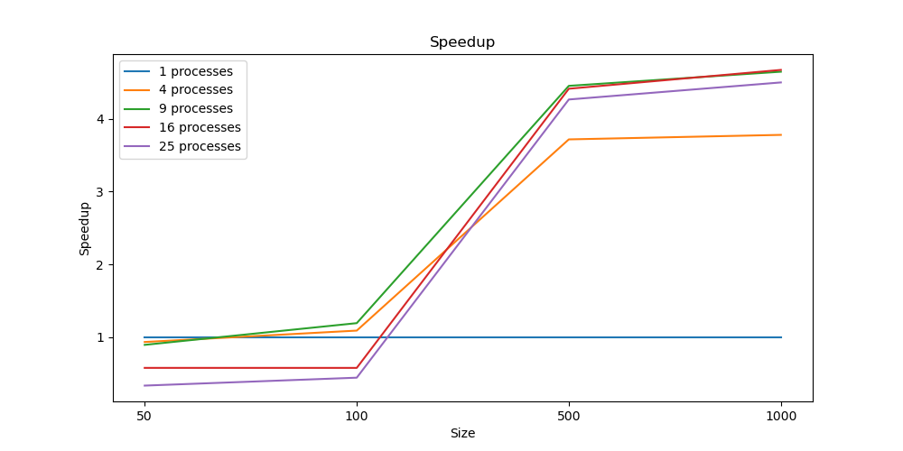
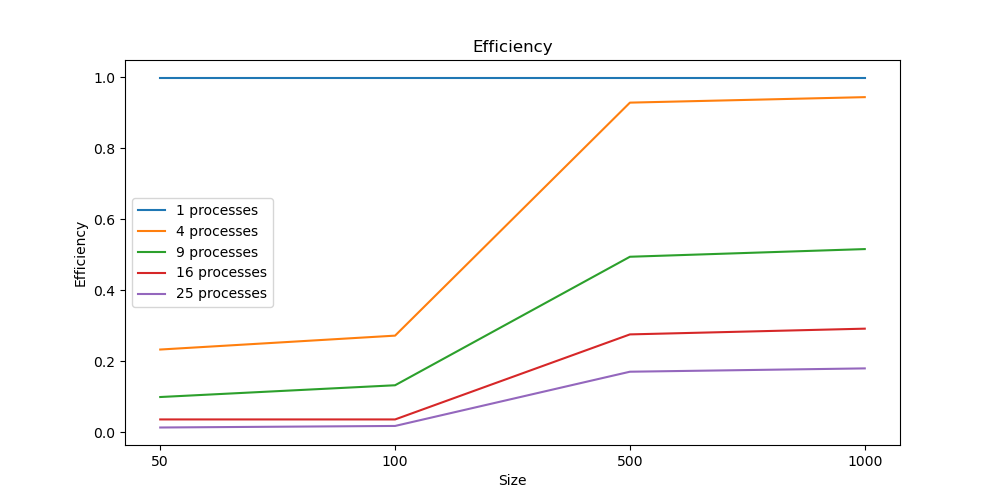

#### Разбиение по столбцам
Наилучшее ускорение – выше `5.1`, благодаря очень уменьшению количества пересылаемых между процессами данных.
А из-за погрешности при измерении получили эффективность выше `0`.
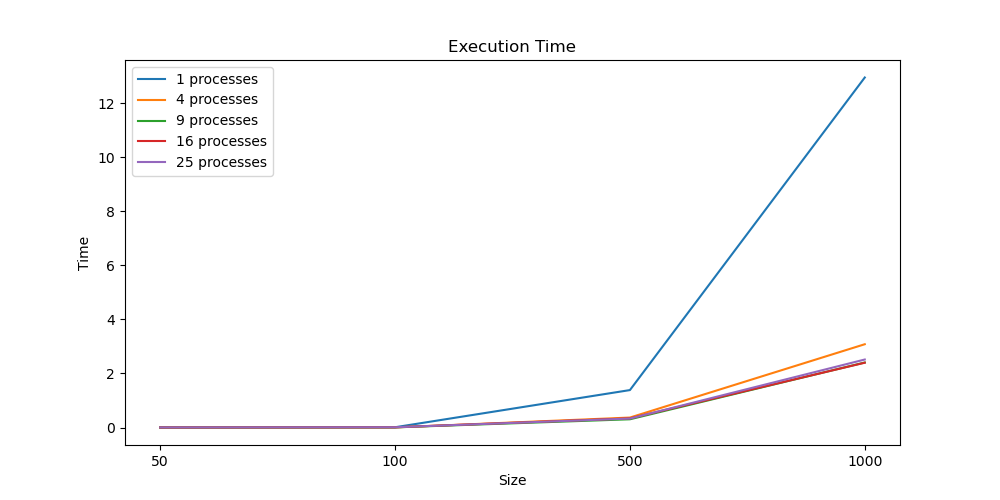
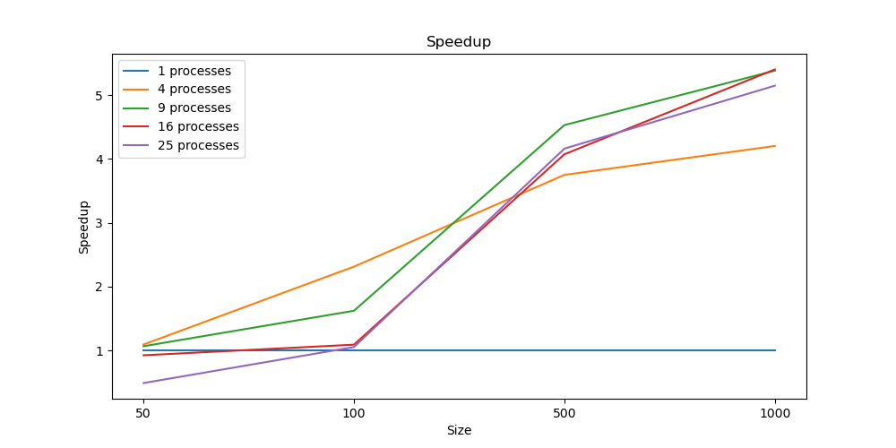
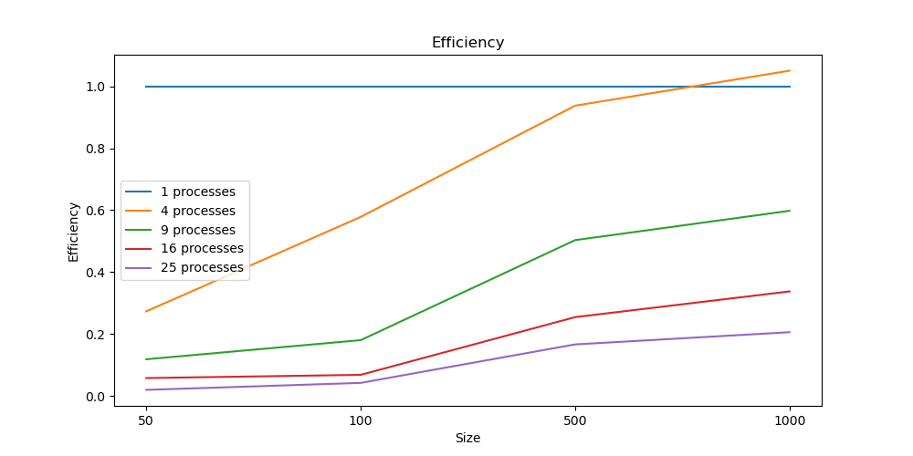

#### Разбиение по блокам
Хорошее ускорение около `5.0`, эффективность тоже впечатляет.
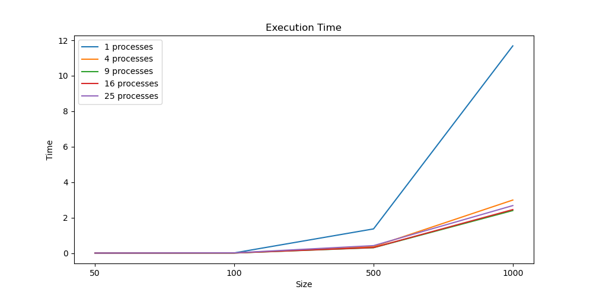
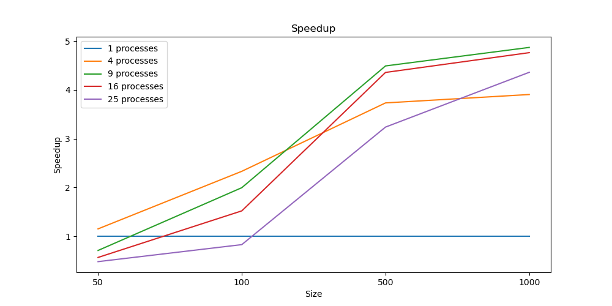
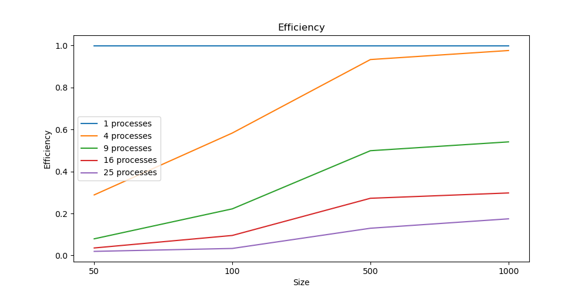

### Итоги
Наиболее стабильно и быстрее всех набирает эффективность алгоритм перемножения с разбиением на блоки.
Но в целом большой разница между алгоритмами нет, все показали себя хорошо.

## Задание 2
### Реализация
Алгоритм до этапа локальных вычислений во многом похож на алгоритм вычисления по блокам.
Однако здесь мы уже требуем квадратности матриц, а также их делимость на размер сетки.

После распределения блоков по потокам мы проводим циклический сдвиг влево на матрице А и вверх на матрице B при помощи `MPI_Sendrecv_replace()` –
одновременно и отправляем данные в следующий блок, и принимаем из предыдущего.

Затем перемножаем полученные блоки и в цикле продолжаем делать циклические сдвиги.

В конце точно также, как и в предыдущих алгоритмах, суммируем через `MPI_Reduce()`

### Графики
Отличное ускорение и практически абсолютная эффективность на 4 процессах. 
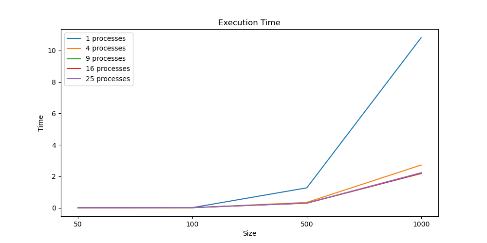
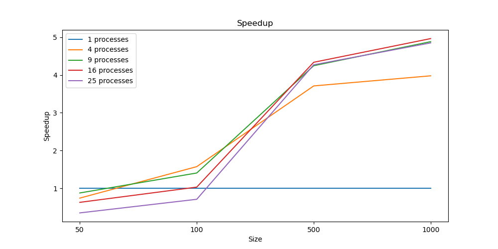
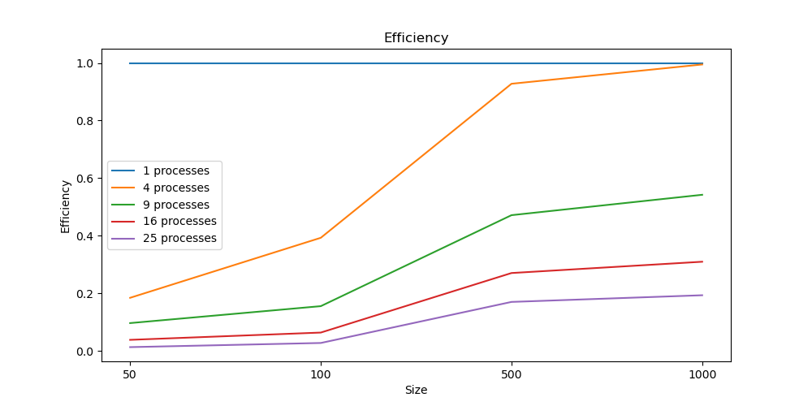